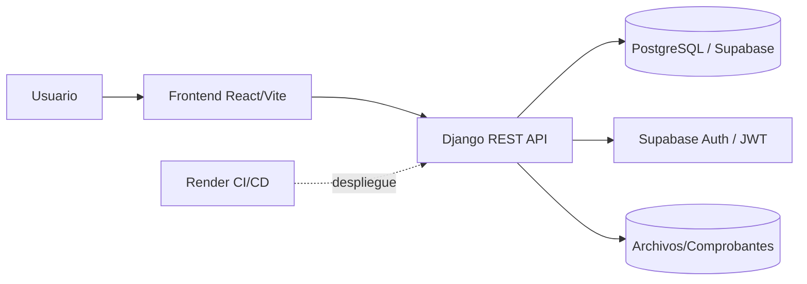
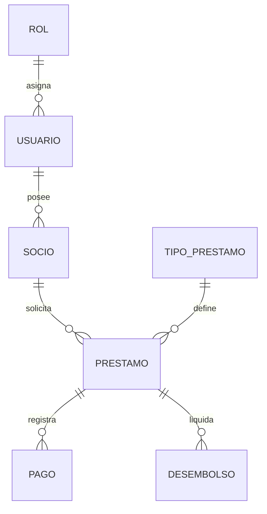

# COOP PRESTAMOS PAGOS
Plataforma para gestionar el ciclo completo de prestamos en una cooperativa: solicitudes, aprobacion, desembolsos, pagos y reportes.

> Diagrama? Se pueden sumar diagramas de arquitectura (backend/frontend), ERD de base de datos o flujos de negocio (solicitud -> aprobacion -> desembolso -> pagos). Si quieres, los añadimos en `docs/` y los referenciamos aqui.

---

<div align="center">


     

</div>

---

## Vision del Proyecto
Sistema integral para la gestion del ciclo de prestamos en una cooperativa, desde la solicitud hasta el cierre, incluyendo registro de pagos, control de morosidad y reportes financieros.

## Objetivo Academico
Aplicar ciclo DevOps, Scrum/Kanban, pruebas automatizadas y buenas practicas (mantenibilidad, modularidad, cohesión y bajo acoplamiento).

---

## Estructura del Proyecto
```text
coop-prestamos-pagos/
├─ backend/                # API Django
│  ├─ apps/                # dominios (socios, usuarios, etc.)
│  ├─ core/                # settings, urls, wsgi
│  ├─ scripts/             # tareas/ops
│  ├─ .env.example         # plantilla backend
│  └─ requirements.txt
├─ frontend/               # UI React/Vite
│  ├─ src/                 # componentes, rutas, servicios
│  └─ package.json
├─ docs/                   # documentacion tecnica/academica
├─ scripts/                # utilidades generales
├─ render.yaml             # configuracion despliegue (Render)
└─ README.md
```

## Stack
- Backend: Python 3.12, Django REST Framework, PostgreSQL.
- Frontend: React + TypeScript + Vite.
- Infraestructura: Render + Supabase (DB y despliegue).

---

## Configuracion Rapida
1) Clonar
```bash
git clone https://github.com/JFabian2606/coop-prestamos-pagos.git
cd coop-prestamos-pagos
```

2) Backend (Windows/PowerShell)
```bash
cd backend
python -m venv .venv
.venv\Scripts\activate
pip install -r requirements.txt
python manage.py migrate
python manage.py runserver
```
Variables backend (usa `backend/.env.example`):
- SECRET_KEY, DEBUG, ALLOWED_HOSTS
- SUPABASE_HOST, SUPABASE_USER, SUPABASE_PASSWORD, SUPABASE_DB_NAME, SUPABASE_PORT, SUPABASE_POOL_MODE
- DB_CONN_MAX_AGE, DB_CONNECT_TIMEOUT, PG_APP_NAME
- SUPABASE_JWT_SECRET, SUPABASE_JWT_AUDIENCE, SUPABASE_JWT_ISS, SUPABASE_JWT_ALGORITHMS, SUPABASE_JWT_LEEWAY
- SUPABASE_ADMIN_ROLES, SUPABASE_ADMIN_EMAILS

3) Frontend
```bash
cd frontend
npm install
npm run dev
```
Variables frontend: `VITE_API_URL` apuntando al backend (ej: `http://127.0.0.1:8000/api/`).

---

## Endpoints Clave
- Socios:
  - `PUT /api/socios/{id}/` actualiza campos permitidos; protege id/estado.
  - `PATCH /api/socios/{id}/estado/` solo admin; transiciones: Activo -> Inactivo/Suspendido, Inactivo/Suspendido -> Activo.
  - Auditoria `SocioAuditLog`: usuario, timestamp, estado anterior/nuevo, cambios.
- Desembolsos:
  - `POST /api/desembolsos/` requiere TESORERO/Admin, valida prestamo aprobado/activo y monto <= prestamo.
  - Si la tabla `desembolso` tiene `tesorero_id`, se usa SQL directo para registrar al tesorero autenticado y evitar errores de integridad.
  - Usa el `id` devuelto para solicitar/descargar el comprobante desde el frontend.
- Documentacion interactiva: `/api/docs/` (esquema JSON en `/api/schema/`).

---

## Pruebas
- Backend: `cd backend && .venv\Scripts\python.exe manage.py test apps.socios`
  - Cubre admin de socios, validacion de estados y flujo de desembolsos (rol tesorero, monto/estado).
- Frontend: ejecutar los scripts de prueba configurados en el proyecto (si existen).

---

## Notas Operativas
- Produccion usa PostgreSQL (Supabase): pooler 6543, conexion directa 5432.
- Revisar `render.yaml` y `Procfile` para despliegue en Render.

---

## Diagramas
### Arquitectura (alto nivel)


### Flujo de negocio (simplificado)


### ERD resumido


Los archivos fuente de mermaid estan en `docs/diagramas/` para editar o generar imagenes si se requiere.
